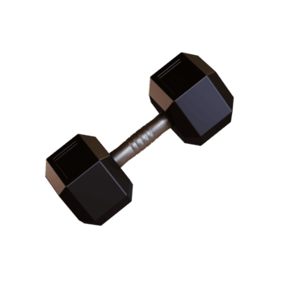
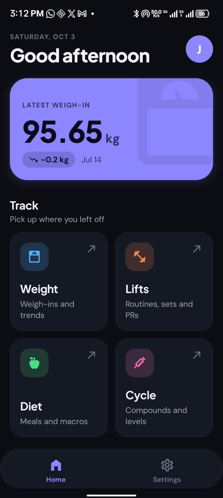
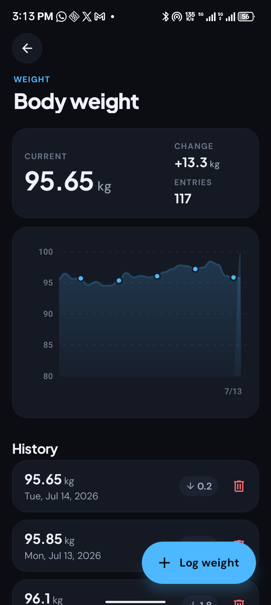
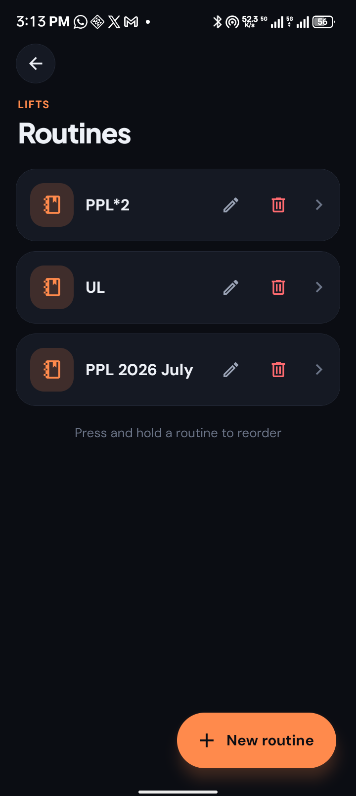
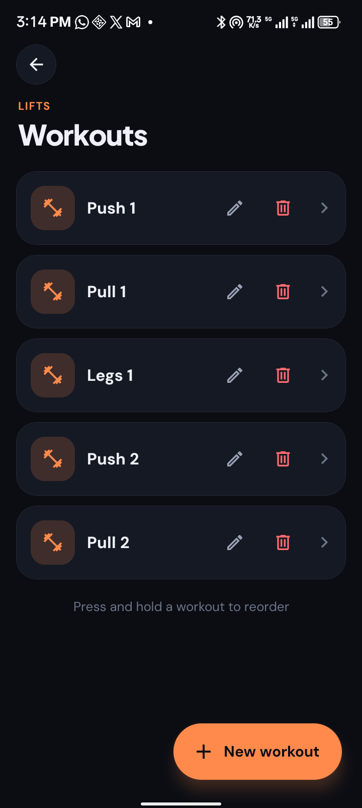
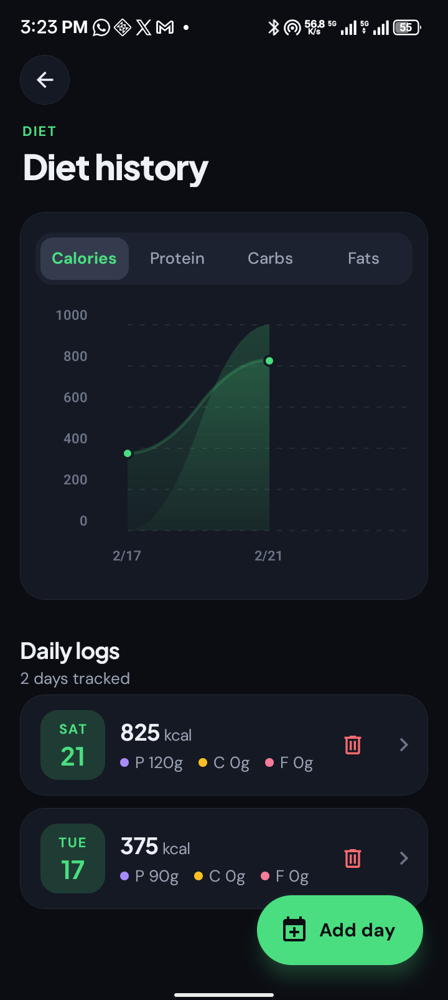

<div align="center">



# Track My Gains

**Your training, all in one place.**

Track weight, workouts, meals, and cycles from a themed dashboard. Built with Expo and React Native for Android, iOS, and the web.


[Features](#features) · [Screenshots](#screenshots) · [Quick start](#quick-start) · [Development](#development)



</div>

---

Keep your daily logs close and your progress easy to see. Track My Gains organizes training into routines, workouts, and exercises; keeps weight and nutrition history; and supports account-based Firestore sync alongside local storage.

## Features

| Feature | What it does |
|---|---|
| **A daily starting point** | A home dashboard with the latest weigh-in and quick access to weight, lifts, diet, and cycles. |
| **Weight history** | Record weigh-ins, see trends, and review changes over time. |
| **Structured training** | Build routines, workouts, and exercises; log sets and reorder your training lists. |
| **Meals and macros** | Organize diets and daily meal logs with protein, carbohydrate, and fat tracking. |
| **Cycle tracking** | Record cycles and their compounds, with views of logged details and levels. |
| **Local data and sync** | SQLite on native platforms, a browser-storage adapter on the web, and Firestore sync for signed-in accounts. |
| **A consistent interface** | Light and dark palettes, shared sheets and controls, and a distinct accent for each tracking area. |

## Screenshots

<table align="center" width="560">
  <tr>
    <td width="50%" align="center" valign="top"><br><sub>Weight trends and history</sub></td>
    <td width="50%" align="center" valign="top"><br><sub>Organize your training routines</sub></td>
  </tr>
  <tr>
    <td width="50%" align="center" valign="top"><br><sub>Build workouts inside each routine</sub></td>
    <td width="50%" align="center" valign="top"><br><sub>Keep nutrition logs alongside training</sub></td>
  </tr>
</table>

Screenshots were captured from the Android app on a connected device.

## Quick start

**Requirements:** Node.js 20+ and npm. For native development, use an Android device/emulator or an iOS simulator on macOS with Xcode.

```sh
npm ci
npm start
```

Use the Expo terminal shortcuts to choose Android, iOS, or web, or start a target directly:

```sh
npm run android
```

```sh
npm run ios
```

```sh
npm run web
```

Native features such as the Android APK downloader require a development or preview build; Expo Go does not provide every native module used by this project.

### Install the Android preview

The repository contains [TrackMyGains-preview-20260928.apk](TrackMyGains-preview-20260928.apk). Download it onto your Android device and open it to install, or use a connected device:

```sh
adb install -r TrackMyGains-preview-20260928.apk
```

## Usage

- **Weight:** record a weigh-in and review the history and chart.
- **Lifts:** create a routine, add workouts and exercises, then record your sets. Press and hold supported lists to reorder them.
- **Diet:** organize nutrition plans and daily meal logs.
- **Cycle:** manage cycles and their compounds.
- **Settings and profile:** manage the app's available preferences and account/sync controls.

## Builds and configuration

Android uses the package name `com.jaggerjack61.TrackMyGains`. Keep it consistent with the Android entry in `google-services.json`. Firebase setup lives in `services/firebase.ts`; Expo configuration is in [app.json](app.json) and EAS profiles are in [eas.json](eas.json).

Start an EAS preview build, then download it using the returned build ID:

```sh
npm run build-apk
npm run download-apk -- --build-id "<build-id>"
```

For another build profile or download location:

```sh
npm run build-apk -- --profile production
npm run download-apk -- --build-id "<build-id>" --output-path "releases/TrackMyGains-preview.apk"
```

The build helper writes a date to `expo.extra.apkVersionDate`. The download helper uses that metadata for dated APK filenames; the Android update checker compares the installed build date with APKs in the repository's `main` branch.

## Development

```sh
npm run lint
npm run typecheck
npm test
```

| Path | Contents |
|---|---|
| `app/` | Expo Router screens and tracking workflows |
| `components/ui/` | Cards, buttons, fields, sheets, and chart helpers |
| `constants/theme.ts` | Light/dark palettes, section accents, spacing, and radii |
| `hooks/use-theme.ts` | Shared theme access |
| `services/database.native.ts` | Native SQLite data adapter |
| `services/database.web.ts` | Browser-storage data adapter |
| `services/firebase.ts` | Authentication and Firestore sync |
| `scripts/` | EAS build and APK download helpers |

Use `useTheme()` for the shared palette and section accents. Reuse the existing `components/ui/` controls to keep new screens consistent with the rest of the app.

## License

[MIT](LICENSE).
